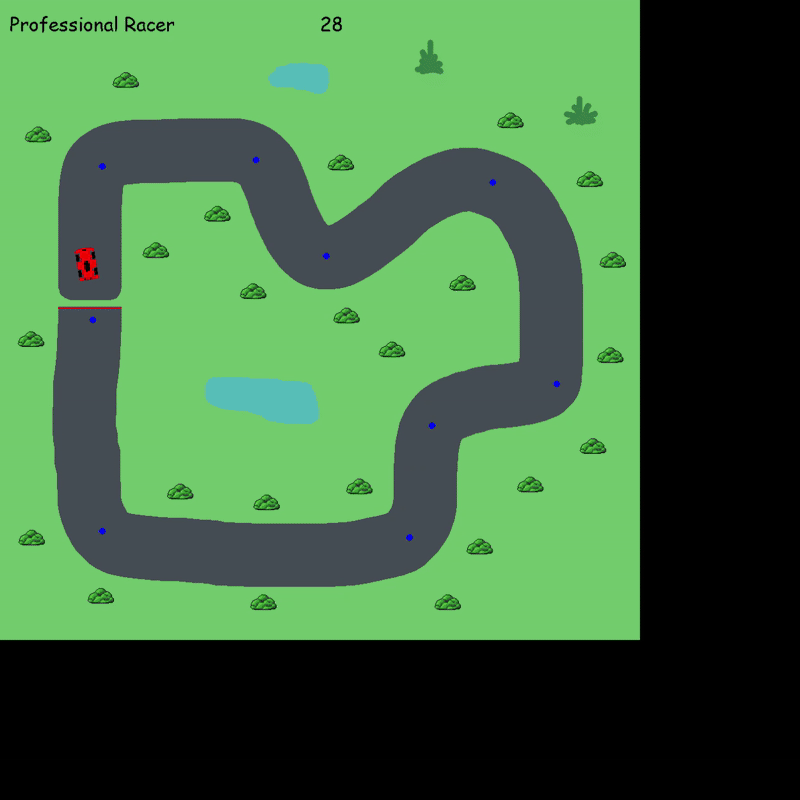

# RL Racing Game


## Overview
This project is a **Reinforcement Learning (RL)-based Racing Game**, built using **Pygame** for rendering and **Deep Deterministic Policy Gradient (DDPG)** for training an autonomous racing agent.

## Features
- **Pygame-based racing environment** with a controllable kart.
- **Deep Reinforcement Learning (DDPG)** implementation for training an AI driver.
- **Customizable parameters** for training and gameplay.
- **Real-time rendering** of the game environment.

## Installation
### Requirements
- Python **3.12+**
- Pygame **2.6.1+**
- PyTorch

### Setup
1. Clone the repository:
   ```sh
   git clone https://github.com/JonasGoebel/hsfd-rl-racing
   cd hsfd-rl-racing
   ```
2. Install dependencies:
   ```sh
   pip install -r requirements.txt
   ```

## Usage
### Training the RL Agent
To train the AI agent using DDPG:
```sh
python src/main.py --train
```
The training process will update the **Actor-Critic** models and improve the AI's racing ability over time.

### Testing a Model
To visualize the capabilities of a model:
```sh
python src/main.py --test
```

## Project Structure
```
├── src/
│   ├── Environment.py   # Game Environment and Rewards
│   ├── main.py          # Game Loop and Training
│   ├── RacingGame.py    # Pygame Game
│   ├── ddpg/
│   │   ├── Actor.py          # Actor model (policy network)
│   │   ├── Critic.py         # Critic model (value network)
│   │   ├── DDPGAgent.py      # Abstract agent, train function
│   │   ├── ReplayBuffer.py   # Stores past experiences
├── img/
│   ├── race_track_001_Legacy.png   # Finite track image (training)
│   ├── race_track_001.png          # Infinite track imgage (testing)
│   ├── kart.png                    # Kart image
├── README.md
├── pyproject.toml  # Project dependencies
```

## Training progress
### First Model

### Intermediate Model

### Final Model


## License
This project is licensed under the MIT License. Feel free to contribute!

