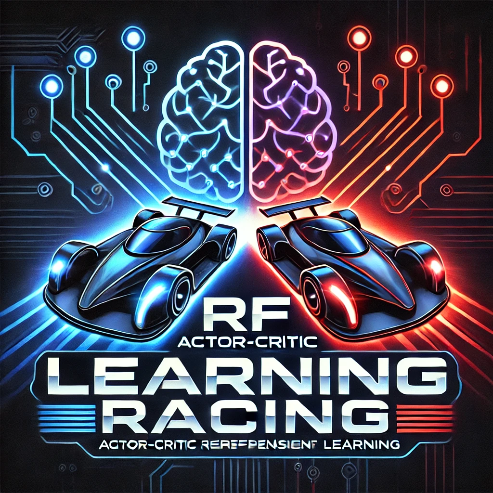

# RL Racing Game



## Overview
This project is a **Reinforcement Learning (RL)-based Racing Game**, built using **Pygame** for rendering and **Deep Deterministic Policy Gradient (DDPG)** for training an autonomous racing agent.

## Features
- **Pygame-based racing environment** with a controllable kart.
- **Deep Reinforcement Learning (DDPG)** implementation for training an AI driver.
- **Customizable parameters** for training and gameplay.
- **Real-time rendering** of the game environment.

## Installation
### Requirements
- Python **3.12+**
- Pygame **2.6.1+**
- PyTorch (if training the agent)

### Setup
1. Clone the repository:
   ```sh
   git clone https://github.com/yourusername/rl-racing-game.git
   cd rl-racing-game
   ```
2. Install dependencies:
   ```sh
   pip install -r requirements.txt
   ```

## Usage
### Running the Game
To start the game manually:
```sh
python src/main.py
```
Use arrow keys to control the kart.

### Training the RL Agent
To train the AI agent using DDPG:
```sh
python src/ddpg/train.py
```
The training process will update the **Actor-Critic** models and improve the AI's racing ability over time.

## Project Structure
```
├── src/
│   ├── main.py          # Game loop
│   ├── RacingGame.py    # Game environment
│   ├── ddpg/
│   │   ├── Actor.py     # Actor model (policy network)
│   │   ├── Critic.py    # Critic model (value network)
│   │   ├── train.py     # Training functions
├── img/
│   ├── race_track_001.png  # Track image
│   ├── kart.png            # Kart sprite
├── README.md
├── pyproject.toml  # Project dependencies
```

## License
This project is licensed under the MIT License. Feel free to contribute!

